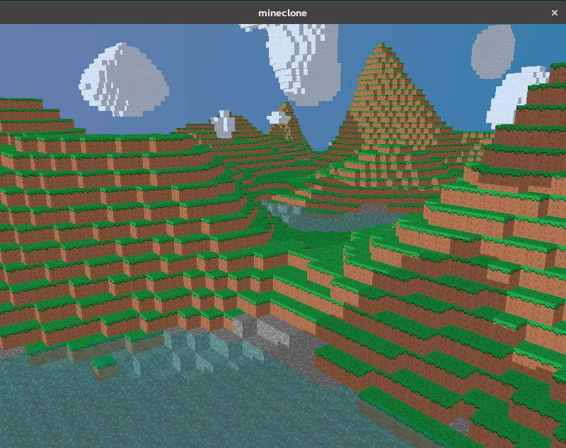

# mineclone

The Mineclone projekt is a 7-day challenge to implement a minecraft clone from scratch in C++.

## build

* Download SDL2-devel (https://www.libsdl.org/release/SDL2-devel-2.0.7-VC.zip), paste the include folder under `mineclone/include/SDL2`, and paste `lib/x86/SDL2.lib` and `lib/x86/SDL2.dll` under `mineclone`
* Install Visual studio if you haven't, open "Developer Command Prompt for Visual Studio", and run `build.bat`
